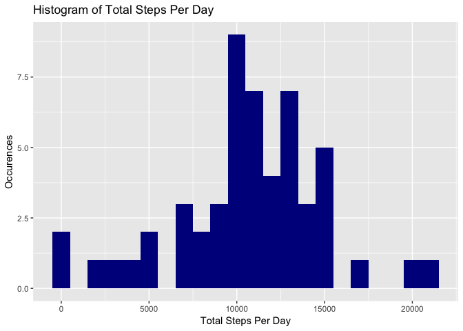
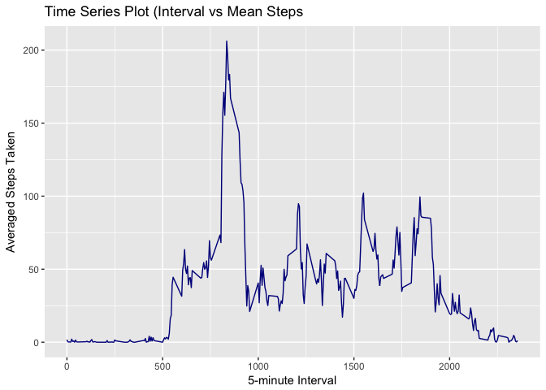
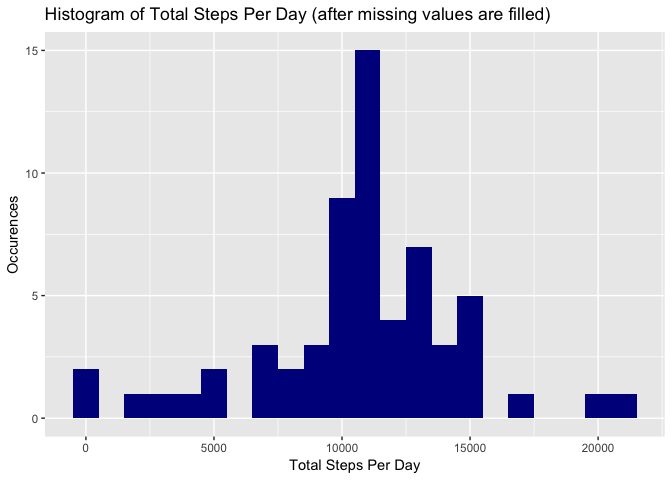
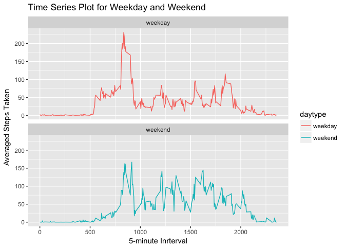

# Reproducible Research: Peer Assessment 1
David W Chang  
6/4/2017  


## Loading and preprocessing the data
Load the given data file using read.csv(). Unzip data file if necessary.


```r
datafile <- "activity.csv"
zip_datafile <-"activity.zip"
if (!file.exists(datafile)){
    unzip(zip_datafile)
}
data <- read.csv(datafile)
```

## What is mean total number of steps taken per day?
First calculate the total number of steps per day using library dplyr
(library is loaded implictly)


```r
total.steps <- data %>%
  filter(!is.na(steps)) %>%
  group_by(date) %>%
  summarize (steps = sum(steps)) %>%
  print
```

```
## # A tibble: 53 × 2
##          date steps
##        <fctr> <int>
## 1  2012-10-02   126
## 2  2012-10-03 11352
## 3  2012-10-04 12116
## 4  2012-10-05 13294
## 5  2012-10-06 15420
## 6  2012-10-07 11015
## 7  2012-10-09 12811
## 8  2012-10-10  9900
## 9  2012-10-11 10304
## 10 2012-10-12 17382
## # ... with 43 more rows
```

Make a histogram of the total number of steps taken per day

```r
library(ggplot2)
ggplot(total.steps, aes(x = steps)) +
  geom_histogram(fill = "darkblue", binwidth =1000) +
  labs(title = "Histogram of Total Steps Per Day", x = "Total Steps Per Day", y = "Occurences")
```

<!-- -->

Calculate the mean of the total number of steps taken per day

```r
mean.total.steps <- mean(total.steps$steps, na.rm=TRUE) %>%
  print
```

```
## [1] 10766.19
```
Calculate the median of the total number of steps taken per day

```r
median.total.steps <- median(total.steps$steps, na.rm=TRUE) %>%
  print
```

```
## [1] 10765
```

## What is the average daily activity pattern?
**Make a time series plot (i.e. 𝚝𝚢𝚙𝚎 = "𝚕") of the 5-minute interval (x-axis) and the average number of steps taken, averaged across all days (y-axis)**

First calculate the mean steps per interval

```r
mean.interval <- data %>%
  filter(!is.na(steps)) %>%
  group_by(interval) %>%
  summarize (steps = mean(steps)) %>%
  print
```

```
## # A tibble: 288 × 2
##    interval     steps
##       <int>     <dbl>
## 1         0 1.7169811
## 2         5 0.3396226
## 3        10 0.1320755
## 4        15 0.1509434
## 5        20 0.0754717
## 6        25 2.0943396
## 7        30 0.5283019
## 8        35 0.8679245
## 9        40 0.0000000
## 10       45 1.4716981
## # ... with 278 more rows
```
Now plot the Time series Plot based on 5-minute Interval vs Average Steps Taken


```r
ggplot(mean.interval, aes(x=interval, y=steps)) +
  geom_line(color = "darkblue") +
  labs(title = "Time Series Plot (Interval vs Mean Steps", x = "5-minute Interval", y = "Averaged Steps Taken")
```

<!-- -->

**Which 5-minute interval, on average across all the days in the dataset, contains the maximum number of steps?**

The interval that has maximum number of steps can be identified by using which.max():


```r
mean.interval[which.max(mean.interval$steps),] %>%
  print
```

```
## # A tibble: 1 × 2
##   interval    steps
##      <int>    <dbl>
## 1      835 206.1698
```
The interval 835 has the maximum number of averaged steps count at 206.

## Imputing missing values

Calculate the total number of missing values in the dataset.

```r
sum(is.na(data$steps)) %>%
  print
```

```
## [1] 2304
```
Total number of missing steps values in the given dataset is 2304

**Devise a strategy for filling in all of the missing values in the dataset. The strategy does not need to be sophisticated. For example, you could use the mean/median for that day, or the mean for that 5-minute interval, etc.**

In this experiment, the mean steps for each interval is used as filler for imputing data


```r
filled.data <- data
nas <- is.na(filled.data$steps)
mean.interval <- tapply(filled.data$steps, filled.data$interval, mean, na.rm=TRUE, simplify=TRUE)
filled.data$steps[nas] <- mean.interval[as.character(filled.data$interval[nas])]
```

**Make a histogram of the total number of steps taken each day and Calculate and report the mean and median total number of steps taken per day. Do these values differ from the estimates from the first part of the assignment? What is the impact of inputing missing data on the estimates of the total daily number of steps?**

Calculate the mean steps per day for the imputed dataset


```r
filled.steps <- filled.data %>%
  filter(!is.na(steps)) %>%
  group_by(date) %>%
  summarize(steps = sum(steps)) %>%
  print
```

```
## # A tibble: 61 × 2
##          date    steps
##        <fctr>    <dbl>
## 1  2012-10-01 10766.19
## 2  2012-10-02   126.00
## 3  2012-10-03 11352.00
## 4  2012-10-04 12116.00
## 5  2012-10-05 13294.00
## 6  2012-10-06 15420.00
## 7  2012-10-07 11015.00
## 8  2012-10-08 10766.19
## 9  2012-10-09 12811.00
## 10 2012-10-10  9900.00
## # ... with 51 more rows
```

Plot the histogram for Total Steps Per Day statistics.


```r
ggplot(filled.steps, aes(x = steps)) +
  geom_histogram(fill = "darkblue", binwidth = 1000) +
  labs(title = "Histogram of Total Steps Per Day (after missing values are filled)", x = "Total Steps Per Day", y = "Occurences")
```

<!-- -->

Calculate the mean of the total number of steps taken per day


```r
mean.filled.steps <- mean(filled.steps$steps, na.rm=TRUE) %>%
  print
```

```
## [1] 10766.19
```
Calculate the median of the total number of steps taken per day

```r
median.filled.steps <- median(filled.steps$steps, na.rm=TRUE) %>%
  print
```

```
## [1] 10766.19
```

After the dataset is imputed with additional data, *total steps per day* occurences are increased. However, the mean and median calculation of *total number of steps taken per day* has shown that the changes doesn't impact much of the mean and median values. This result is consistent to the fact that increasing sample size doens't always impact the mean and median of sample data. 

## Are there differences in activity patterns between weekdays and weekends?

**Create a new factor variable in the dataset with two levels -- "weekday" and "weekend" indicating whether a given date is a weekday or weekend day.**

Define a new function to retrn weekday status and add a new header field to indicate weekday status.


```r
## define a functioon to return weekday status
weekday <- function(date) {
    day <- weekdays(date)
    if (day %in% c("Monday", "Tuesday", "Wednesday", "Thursday", "Friday"))
        return("weekday")
    else if (day %in% c("Saturday", "Sunday"))
        return("weekend")
    else
        stop("invalid date")
}
## add a new header field to indicate weekday status
filled.data$date <- as.Date(filled.data$date)
filled.data$daytype <- sapply(filled.data$date, FUN=weekday)
filled.data$daytype <- as.factor(filled.data$daytype)
```

**Make a panel plot containing a time series plot (i.e. `type = "l"`) of the 5-minute interval (x-axis) and the average number of steps taken, averaged across all weekday days or weekend days (y-axis).**

Aggregate averaged steps count based on interval and weekday status (i.e.**daytype**) 


```r
filled.interval <- aggregate(steps ~ interval + daytype, data=filled.data, mean)
```

Plot the aggregated data into two separarted time series plots.


```r
ggplot(filled.interval, aes(x=interval, y=steps, color = daytype)) +
  geom_line() +
  facet_wrap(~daytype, ncol = 1, nrow=2) + 
  labs(title = "Time Series Plot for Weekday and Weekend", x = "5-minute Inrterval", y = "Averaged Steps Taken")
```

<!-- -->

When comparing the two time series plots, weekdays seems has more activities between 500 and 750 intervals.
